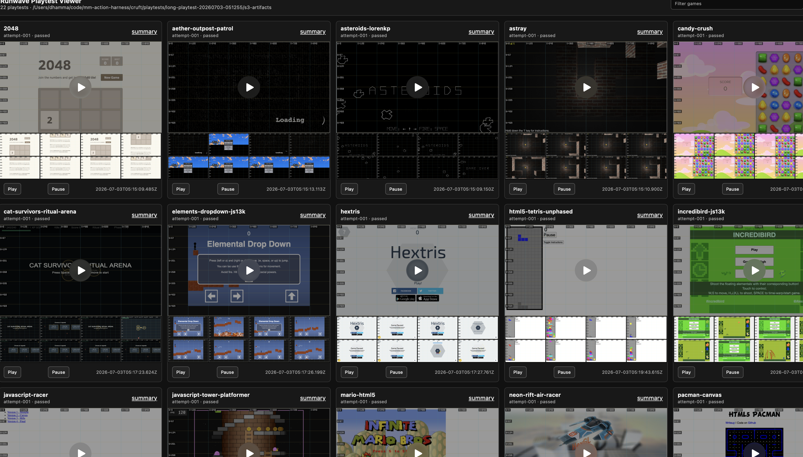

# Runwave Playtest Fleet

This directory contains the local orchestration and remote worker scripts for
running many browser-game playtests across Hetzner servers.

## Shape

- Fleet: 8 workers by default. Use hardware-WebGL-verified workers for full
  batches that include WebGL-sensitive games such as `aether-outpost-patrol`.
- Capacity: 24 concurrent playtests at the default `3` jobs per server, sized
  for 20 simultaneous playtests plus headroom.
- Games: synced from `s3://pw-cruft/games` to every server at
  `/opt/runwave/games`.
- Runner: installed at `/opt/runwave/bin/run-playtest.js`.
- Per playtest: start a dedicated Docker container, clone the requested runwave
  repo/ref inside it, install dependencies, run a browser playtest in an
  isolated workspace for 2 minutes by default, capture video plus browser audio,
  then upload the full workspace to S3.
- SSH: set `RUNWAVE_SSH_KEY` to the local private key used for workers. During
  provisioning, set `RUNWAVE_SSH_KEY_NAME` if the Hetzner key name cannot be
  inferred from the matching local public key.

Real fleet runs should use the agentic OpenRouter planner with `--agent` or
`--play-mode agent`. The scripted exploration path is kept only for local smoke
tests and controller debugging, and should not be used for fleet results. The
controller still only controls the browser; the agent planner lives separately
under `agent/`.

## Provision

Create the fleet. For production batches with WebGL-sensitive games, set
`SERVER_TYPE` to a worker type that has already been verified to expose a
non-SwiftShader Chromium WebGL renderer:

```sh
export RUNWAVE_SSH_KEY="$HOME/.ssh/id_ed25519"
# Optional if the Hetzner key name cannot be inferred from RUNWAVE_SSH_KEY.pub:
# export RUNWAVE_SSH_KEY_NAME="<hetzner-ssh-key-name>"
SERVER_TYPE=<verified-worker-type> SERVER_COUNT=8 LOCATION=hel1 ops/provision-hetzner.sh
```

Defaults:

- `SERVER_TYPE=ccx43` in the script, unless overridden
- `SERVER_COUNT=8`
- `LOCATION=hel1`
- `RUNWAVE_SSH_KEY_NAME` / `SSH_KEY_NAME`, or inferred from
  `RUNWAVE_SSH_KEY.pub` / `SSH_KEY.pub`

The script writes an inventory file under `cruft/inventory/`. This is local
generated state and should not be committed.

## Bootstrap

Install dependencies and sync all browser games from S3 to each server:

```sh
ops/bootstrap-servers-parallel.sh cruft/inventory/<batch>.json
```

This reads credentials from `~/.c.yaml` and writes them to
`/etc/runwave-runner.env` on each server with mode `0600`. Per-worker logs are
written under `cruft/playtests/_bootstrap-logs/<batch>/`.

Bootstrap installs Docker and builds the `runwave-playtest-runner:latest` image.
The host runner re-execs each job in its own container, mounting the game cache,
job workspace root, job JSON, runner script, and `/etc/runwave-runner.env`.
Inside that container, the runner creates a PulseAudio null sink named
`runwave_sink`, launches Chromium with that sink as the default output, and uses
one GStreamer process to record the cropped X display plus `runwave_sink.monitor`
into `video/000-runwave-with-audio.webm`. This keeps audio from concurrent games
on the same worker out of each other's recordings and avoids post-mux sync
offsets.
Recorded fleet jobs use this GStreamer path; there is no Playwright video-only
fallback for production playtests.

The default game source is `s3://pw-cruft/games`. Override it with:

```sh
GAMES_S3_URI=s3://OTHER_BUCKET/other-prefix ops/bootstrap-servers-parallel.sh cruft/inventory/<batch>.json
```

## Run

Run one attempt per detected browser game:

```sh
node ops/orchestrate-playtests.js \
  --inventory cruft/inventory/<batch>.json \
  --s3-uri s3://pw-cruft/playtests \
  --games-s3-uri s3://pw-cruft/games \
  --runwave-ref runwave-agentic-player \
  --agent
```

With 22 browser games in `s3://pw-cruft/games`, that command schedules one
playtest per discovered browser game. By default the local orchestrator discovers that game list from
`s3://pw-cruft/games`, not from the local checkout.

Run one agentic attempt for every discovered browser game:

```sh
export RUNWAVE_SSH_KEY="$HOME/.ssh/id_ed25519"
node ops/orchestrate-playtests.js \
  --inventory cruft/inventory/<batch>.json \
  --s3-uri s3://pw-cruft/playtests \
  --games-s3-uri s3://pw-cruft/games \
  --runwave-ref runwave-agentic-player \
  --play-mode agent \
  --max-duration 120000 \
  --min-duration 110000 \
  --ssh-key "$RUNWAVE_SSH_KEY" \
  --concurrency-per-server 3
```

With 8 servers and `--concurrency-per-server 3`, the fleet can start 24 jobs at
once. The orchestrator refuses a 20-job run if the inventory cannot provide at
least 20 concurrent slots.

Only browser games whose `start.sh` serves HTTP are scheduled by default.
Unity/editor-only projects are installed on the machines but skipped because
runwave drives browser targets.

For agent jobs, if `--min-duration` is not provided, the orchestrator
sets it to `--max-duration - 10000`. A 120 second run therefore requires
about 110 seconds of play before the agent is allowed to stop.

Remote playtest jobs derive `viewport` and `videoSize` from each game's
`metadata.json`. Job JSON should normally omit those fields unless a lower-level
debug path explicitly needs to override controller start options.

## Agent Mode

Agent mode uses the browser controller as the hands and the `agent/` package as the
model-calling planner. The planner currently uses OpenRouter, reading
`OPENROUTER_API_KEY` from the environment or `~/.c.yaml`. Override the model with
`RUNWAVE_AGENT_MODEL` or `OPENROUTER_MODEL`.

For a single local game smoke:

```sh
docker build -f ops/remote/playtest-runner.Dockerfile \
  -t runwave-playtest-runner:latest \
  ops/remote

aws s3 sync s3://pw-cruft/games/mario-html5/ \
  cruft/playtests/_games-cache/mario-html5/ \
  --delete --only-show-errors

RUNWAVE_GAMES_ROOT="$PWD/cruft/playtests/_games-cache" \
RUNWAVE_JOBS_ROOT="$PWD/cruft/playtests/local-agent-smoke/jobs" \
node ops/remote/run-playtest.js --job ops/examples/job-agent-mario.local.json
```

Linux local smoke runs use the same Docker wrapper by default. Set
`RUNWAVE_PLAYTEST_CONTAINER=0` only for debugging the runner directly on the
host.

On machines with Chrome already installed and Playwright downloads blocked, set
`skipPlaywrightInstall: true` and `channel: "chrome"` in the job JSON.

For a server-side one-game agent run, use
`ops/examples/job-agent-mario.server.json`. It runs agent mode for a 3-minute
safety window and enables verbose controller timing logs.

## Viewer

After downloading artifacts, build a local video viewer:



```sh
node ops/build-playtest-viewer.js \
  --artifacts cruft/playtests/<run-id>/s3-artifacts \
  --out cruft/playtests/<run-id>/viewer/index.html
```
